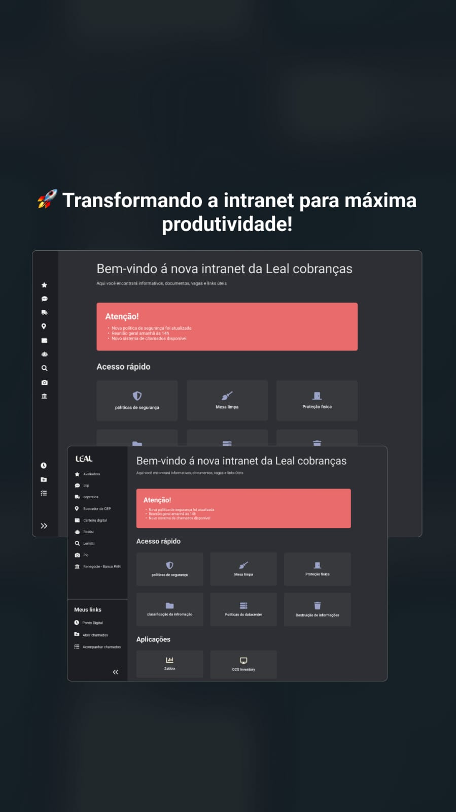

# Intranet
# 🛡️ Infranet - Segurança e TI  

> Um site interativo para acesso rápido a políticas de segurança da informação.

## 📸 Demonstração  



## 🚀 Tecnologias  

- HTML  
- CSS  
- JavaScript  

## 🔧 Funcionalidades  

✅ Acesso rápido às principais políticas de segurança  
✅ Interface moderna e responsiva  
✅ Navegação simplificada  

## 🖥️ Como Executar  

1. Clone este repositório:  
   ```bash
   git clone https://github.com/SAMARAPOVOAS505/infranet.git

   <a href="politicas.html" target="_blank">Políticas de Segurança</a>
<a href="mesa-limpa.html" target="_blank">Mesa Limpa,</a>
<a href="protecao-fisica.html" target="_blank">Proteção Física</a>

